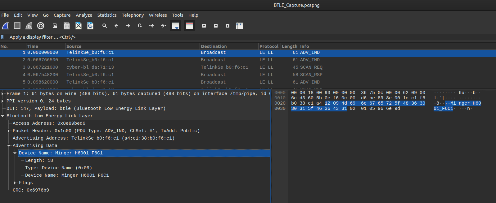

# 01 - Flickering Light Bulb 💡 1/4 
Pour cette série de challenges, un fichier de capture Wireshark `BTLE_Capture.pcapng` est fourni.

Le nom du challenge et le nom du fichier indique qu'il faudra analyser des paquets Bluetooth d'une ampoule intelligente.

Si en ouvrant le fichier dans Wireshark les paquets ne sont pas bien décodés. Il faut ajuster cette option:

> Go to Preferences->Protocols->DLT_USER and enter "btle" as protocol
> https://github.com/greatscottgadgets/ubertooth/issues/61

Le premier flag consiste à trouver le nom de l'ampoule:


Il suffit de prendre un paquet de type `ADV_IND` afin de retrouver le nom de l'appareil

```
Minger_H6001_F6C1
```
