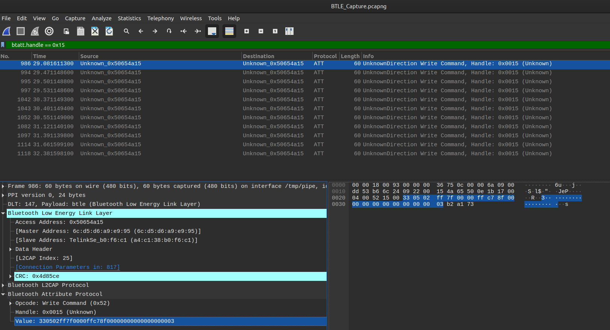

# 02 - Flickering Light Bulb 💡 2/4

Le deuxième flag consiste à trouver la valeur qui a été envoyé à l'ampoule afin de changer sa couleur pour bleu.

En recherchant le modèle de l'ampoule, on retrouve ce repo sur github qui explique comment le trafic Bluetooth fonctionne.
> https://github.com/chvolkmann/govee_btled

Le handle utilisé pour envoyer une requête à l'ampoule est `0x15`. Pour filtrer sur ces paquêts dans Wireshark, on peut utiliser ce filtre.

```
btatt.handle == 0x15
```



Voici un exemple de valeur obtenue dans un paquet:

```
33 05 02 ff7f00 00 ffc78f 000000000000000000 03
```

- Type de data
  - `0x33`: RGB Data
  - `0xaa`: ??
- Type de commande
  - `0x01`: Power
  - `0x04`: Brightness
  - `0x05`: Color
- Mode
  - `0x02`: Manual mode
- Couleur (`0xffffff`) (si toggle à `0x00`)
- Toggle
  - `0x00`: RGB
  - `0x01`: Warm/Cold White
- Valeurs pour Warm/Cold White (si toggle à `0x01`)
- Zero padding
- Checksum

Pour trouver le flag, il faut trouver un paquet avec la couleur à `0x0000ff`. Il n'y en a pas beaucoup, on peut les vérifier un par un et trouver cette valeur:

> 3305020000ff00ffc78f0000000000000000007c
